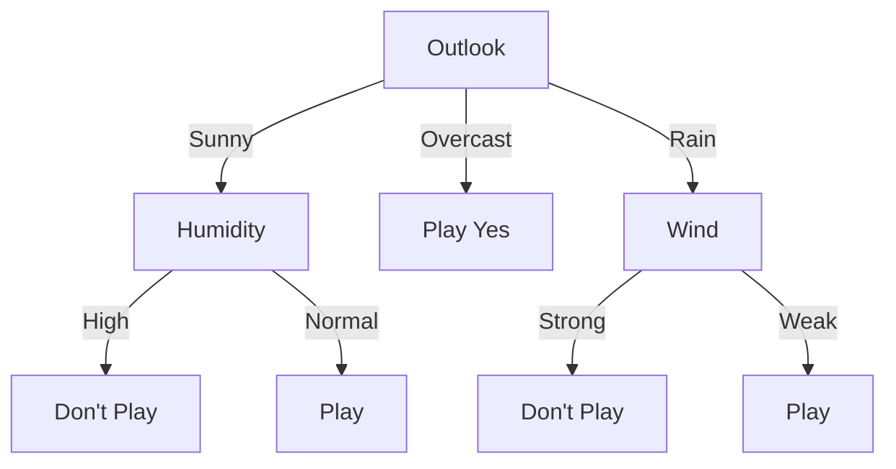

# Using Information Gain

## Level 1

| Day | Outlook  | Temperature | Humidity | Wind   | Play Golf |
|-----|----------|-------------|----------|--------|-----------|
| 1   | Sunny    | Hot         | High     | Weak   | No        |
| 2   | Sunny    | Hot         | High     | Strong | No        |
| 3   | Overcast | Hot         | High     | Weak   | Yes       |
| 4   | Rain     | Mild        | High     | Weak   | Yes       |
| 5   | Rain     | Cool        | Normal   | Weak   | Yes       |
| 6   | Rain     | Cool        | Normal   | Strong | No        |
| 7   | Overcast | Cool        | Normal   | Strong | Yes       |
| 8   | Sunny    | Mild        | High     | Weak   | No        |
| 9   | Sunny    | Cool        | Normal   | Weak   | Yes       |
| 10  | Rain     | Mild        | Normal   | Weak   | Yes       |
| 11  | Sunny    | Mild        | Normal   | Strong | Yes       |
| 12  | Overcast | Mild        | High     | Strong | Yes       |
| 13  | Overcast | Hot         | Normal   | Weak   | Yes       |
| 14  | Rain     | Mild        | High     | Strong | No        |

$H(\textrm{Play Golf}) = H(5,9) = -\cfrac{5}{14}*\log_2\bigg(\cfrac{5}{14}\bigg)-\cfrac{9}{14}*\log_2\bigg(\cfrac{9}{14}\bigg) = 0.940$

Where:
- Yes (Play Golf) = 5 instances
- No (Don't Play Golf) = 9 instances
- Total = 14 instances

### 1. Outlook (Sunny, Overcast, Rain)

$H(\text{Play Golf}|\text{Sunny})$ $\log_2$
$= -\cfrac{2}{5}$$*\log_2(\cfrac{2}{5})$$-\cfrac{3}{5}*$\log _2(\cfrac{3}{5}) = 0.971$

$H(\text{Play Golf}|\text{Overcast}) = -1*\log_2(1)-0*\log_2(0) = 0$

$H(\text{Play Golf}|\text{Rain}) = -\cfrac{2}{5}*\log_2\bigg(\cfrac{2}{5}\bigg)-\cfrac{3}{5}*\log_2\bigg(\cfrac{3}{5}\bigg) = 0.971$

$H_{avg}(\text{Play Golf | Outlook}) = \cfrac{5}{14}*0.971 + \cfrac{4}{14}*0 + \cfrac{5}{14}*0.971 = 0.694$

$IG(\text{Outlook}) = 0.940 - 0.694 = 0.246$ ✅

### 2. Temperature (Hot, Mild, Cool)

$H(\text{Play Golf}|\text{Hot}) = -\cfrac{2}{4}*\log_2\bigg(\cfrac{2}{4}\bigg)-\cfrac{2}{4}*\log_2\bigg(\cfrac{2}{4}\bigg) = 1.000$

$H(\text{Play Golf}|\text{Mild}) = -\cfrac{4}{6}*\log_2\bigg(\cfrac{4}{6}\bigg)-\cfrac{2}{6}*\log_2\bigg(\cfrac{2}{6}\bigg) = 0.918$

$H(\text{Play Golf}|\text{Cool}) = -\cfrac{3}{4}*\log_2\bigg(\cfrac{3}{4}\bigg)-\cfrac{1}{4}*\log_2\bigg(\cfrac{1}{4}\bigg) = 0.811$

$H_{avg}(\textrm{Play Golf | Temperature}) = \cfrac{4}{14}*1.000 + \cfrac{6}{14}*0.918 + \cfrac{4}{14}*0.811 = 0.911$

$IG(\text{Temperature}) = 0.940 - 0.911 = 0.029$
### 3. Humidity (High, Normal)

$H(\text{Play Golf}|\text{High}) = -\cfrac{1}{7}*\log_2\bigg(\cfrac{1}{7}\bigg)-\cfrac{6}{7}*\log_2\bigg(\cfrac{6}{7}\bigg) = 0.592$

$H(\text{Play Golf}|\text{Normal}) = -\cfrac{4}{7}*\log_2\bigg(\cfrac{4}{7}\bigg)-\cfrac{3}{7}*\log_2\bigg(\cfrac{3}{7}\bigg) = 0.985$

$H_{avg}(\text{Play Golf | Humidity}) = \cfrac{7}{14}*0.592 + \cfrac{7}{14}*0.985 = 0.789$

$IG(\text{Humidity}) = 0.940 - 0.789 = 0.151$

### 4. Wind (Strong, Weak)

$H(\text{Play Golf}|\text{Strong}) = -\cfrac{3}{6}*\log_2\bigg(\cfrac{3}{6}\bigg)-\cfrac{3}{6}*\log_2\bigg(\cfrac{3}{6}\bigg) = 1.0$

$H(\text{Play Golf}|\text{Weak}) = -\cfrac{6}{8}*\log_2\bigg(\cfrac{6}{8}\bigg)-\cfrac{6}{8}*\log_2\bigg(\cfrac{6}{8}\bigg) = 0.811$

$H_{avg}(\text{Play Golf | Wind}) = \cfrac{6}{14}*1.0 + \cfrac{8}{14}*0.811 = 0.892$

$IG(\text{Wind}) = 0.940 - 0.892 = 0.048$

## Level 2

### Subtables After Outlook Split

#### 1. Sunny Outlook

| Day | Temperature | Humidity | Wind   | Play Golf |
|-----|------------|----------|--------|-----------|
| 1   | Hot        | High     | Weak   | No        |
| 2   | Hot        | High     | Strong | No        |
| 8   | Mild       | High     | Weak   | No        |
| 9   | Cool       | Normal   | Weak   | Yes       |
| 11  | Mild       | Normal   | Strong | Yes       |

Entropy for Sunny:
$H(\text{Sunny}) = -\cfrac{2}{5}*\log_2\bigg(\cfrac{2}{5}\bigg)-\cfrac{3}{5}*\log_2\bigg(\cfrac{3}{5}\bigg) = 0.971$

##### Information Gain - Sunny:

1. **Temperature** (Hot, Mild, Cool)
   $H(Play|Hot) = 0$
   $H(Play|Mild) = 1$
   $H(Play|Cool) = 0$
   $IG(Temperature) = 0.971 - (\frac{2}{5}*0 + \frac{2}{5}*1 + \frac{1}{5}*0) = 0.571$

2. **Humidity** (High, Normal)
   $H(Play|High) = 0$
   $H(Play|Normal) = 0$
   $IG(Humidity) = 0.971 - (\frac{3}{5}*0 + \frac{2}{5}*0) = 0.971$ ✅

3. **Wind** (Strong, Weak)
   $H(Play|Strong) = 1$
   $H(Play|Weak) = 0.918$
   $IG(Wind) = 0.971 - (\frac{2}{5}*1 + \frac{3}{5}*0.918) = 0.020$

#### 2. Overcast Outlook

| Day | Temperature | Humidity | Wind   | Play Golf |
|-----|------------|----------|--------|-----------|
| 3   | Hot        | High     | Weak   | Yes       |
| 7   | Cool       | Normal   | Strong | Yes       |
| 12  | Mild       | High     | Strong | Yes       |
| 13  | Hot        | Normal   | Weak   | Yes       |

Note: No further splitting needed as all instances are "Yes"

#### 3. Rain Outlook

| Day | Temperature | Humidity | Wind   | Play Golf |
|-----|------------|----------|--------|-----------|
| 4   | Mild       | High     | Weak   | Yes       |
| 5   | Cool       | Normal   | Weak   | Yes       |
| 6   | Cool       | Normal   | Strong | No        |
| 10  | Mild       | Normal   | Weak   | Yes       |
| 14  | Mild       | High     | Strong | No        |

Initial Entropy for Rain:
$H(\text{Rain}) = -\cfrac{3}{5}*\log_2\bigg(\cfrac{3}{5}\bigg)-\cfrac{2}{5}*\log_2\bigg(\cfrac{2}{5}\bigg) = 0.971$

##### Information Gain - Rain

1. **Temperature** (Mild, Cool)
   $H(Play|Mild) = 0.918$
   $H(Play|Cool) = 1$
   $IG(Temperature) = 0.971 - (\frac{3}{5}*0.918 + \frac{2}{5}*1) = 0.020$

2. **Humidity** (High, Normal)
   $H(Play|High) = 1$
   $H(Play|Normal) = 0.918$
   $IG(Humidity) = 0.971 - (\frac{2}{5}*1 + \frac{3}{5}*0.918) = 0.020$

3. **Wind** (Strong, Weak)
   $H(Play|Strong) = 0$
   $H(Play|Weak) = 0$
   $IG(Wind) = 0.971 - (\frac{2}{5}*0 + \frac{3}{5}*0) = 0.971$ ✅
### Decision Tree

